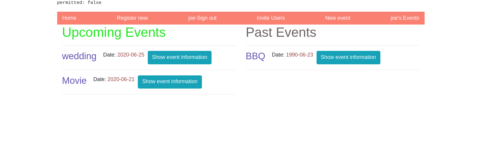

# Private events!
A user can create events. A user can attend many events. An event can be attended by many users. This application required a model many-to-many relationships.

User profile can view all user hosted events
home page shows all events that a upcoming (future dates only)
User can sign up/login/be remembered in the cookies
only logged in users can create events
Event’s Show page displays a list of attendees.
User’s profile(show) page displays a list of events they are attending.
Users can invite to their most recently created event.

# Install
1. Install 

> $ git clone <respositoryURL>

2. Bundle install

> $ bundle install

# Use

1. start the rails server

> $ rails server

2. Go to browser and visit 

> http://localhost:3000/

## Built With

- Ruby on Rails
- VSCode

## Author

👤 **Dannison Arias**

- Github: [@dannisonarias](https://github.com/dannisonarias)
- Twitter: [@AriasDannison](https://twitter.com/AriasDannison)
- Linkedin: [Dannison Arias](https://www.linkedin.com/in/dannison-arias-777919190/)

## 🤝 Contributing

Contributions, issues and feature requests are welcome!

Feel free to check the [issues page](issues/).

## Show your support

Give a ⭐️ if you like this project!

## Acknowledgments

- Microverse
- The Odin Project

## 📝 License

This project is [MIT](./license.md) licensed.